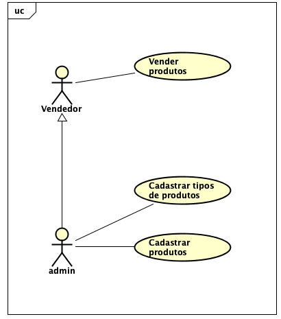
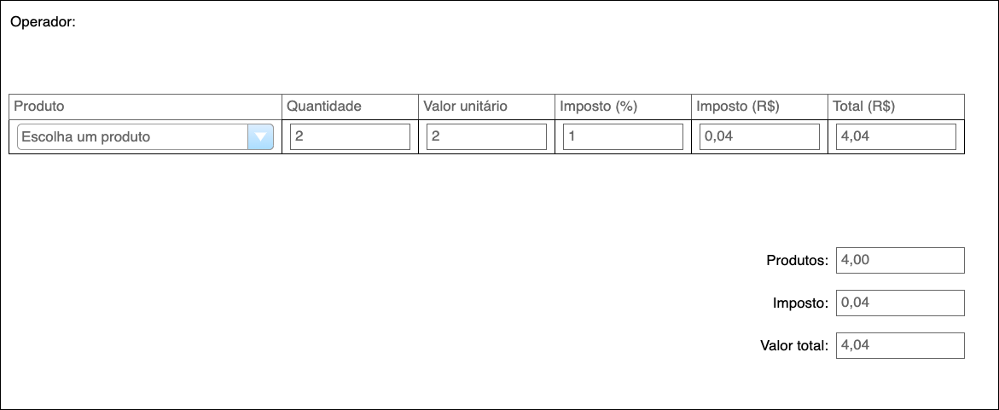
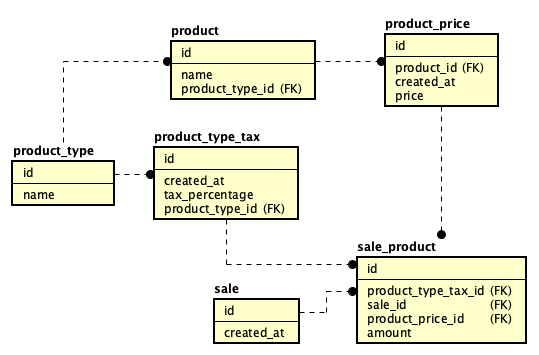
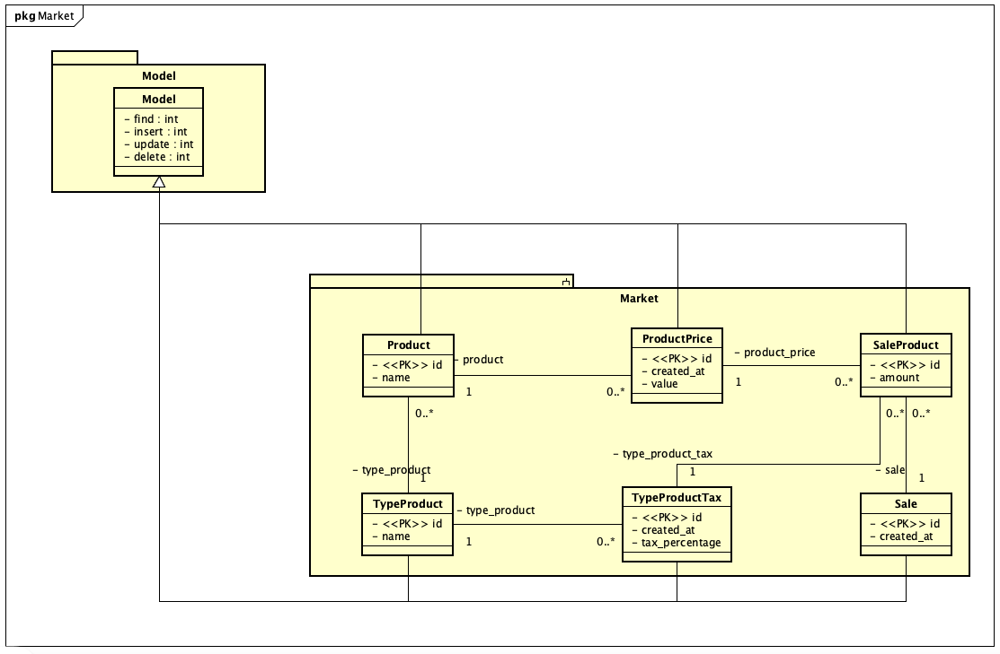

# Projeto Mercado

Casos de uso
---



Requisitos do sistema
--

1. Cadastro de tipos de produtos

    1. O sistema deve ter uma tela para cadastrar os tipos de produtos
    2. A tela de cadastro de tipos de produtos deve ter uma lista com os tipos de produtos já cadastrados.
    3. A tela de cadastro de tipos de produtos deve ter um campo de tipo texto para informar a descrição de um novo tipo de produto.

2. Cadastro de produtos

   1. O sistema deverá ter uma tela para listar os produtos cadastrados
   2. O sistema deverá ter uma tela para cadastrar um novo produto
   3. A tela de produtos cadastrados deverá ter uma tabela com as colunas: Descrição, Tipo, (Coluna de ação)
   4. A tela de de produtos deverá ter um botão **Cadastrar novo produto**
   5. A tela de cadastro de produto deverá ter os campos:
      - Seleção do tipo de produto
      - Descrição do produto

3. Cadastro do imposto por tipo de produto

    1. O sistema deve ter uma tela para cadastrar os impostos abatidos em cada tipo de produto
    2. A tela de cadastro do imposto por tipo de produto deve ter uma tabela trazendo todos os tipos de produtos já cadastrados
    3. A tabela com os impostos dos tipos de produtos deve ter uma coluna com as descrições dos tipos de produtos cadastrados
    4. A tabela com os impostos dos tipos de produtos deve ter uma coluna com um input com o valor do imposto do tipo de produto
    5. A tabela com os impostos dos tipos de produtos deve ter uma coluna com um botão de ação para salvar o valor incluído pelo usuário

4. Cadastro de valor de produtos
   1. O sistema deve ter uma tela para listar os valores de cada de produto
   2. 1. O sistema deve ter uma tela para cadastrar o valor de um novo produto
   3. A tela de visualização dos valores de cada de produto deve ter uma tabela trazendo todos os produtos cadastrados no sistema com as colunas: Nome, tipo de produto, unidade de medida, último valor cadastrado.
   4. A tela de visualização dos valores de cada de produto deverá ter um botão **Cadastrar novo produto**.
   5. A tela para cadastro de novo produto terá um input para selecionar o produto que será adicionado um novo valor
   6. A tela para cadastro de novo produto terá um input para indicar o valor do produto.

5. Tela de vendas
   1. O sistema deverá ter uma tela para listar vendas realizadas
   2. O sistema deverá ter uma tela para cadastrar uma nova venda.
   3. A tela de vendas deverá ter uma lista com um resumo das vendas realizadas
   4. A tela de vendas deverá ter um botão **Realizar venda**
   5. A tela **Nova venda** deverá ter uma lista contendo os itens daquela venda
   6. A tela de vendas deverá ter um botão **Adicionar item**
   7. O botão **Adicionar item** deverá adicionar uma nova linha na tabela de itens da venda com dados vazios
   8. A tabela dos itens da venda deverá ter as colunas: Item, Tipo, Quantidade, Valor Unitário, Valor Total, Imposto (%), Imposto (R$), (Coluna de botões de ação)
   9. A última coluna da tabela dos itens da venda deverá ter um botão com ícone de lixeira que irá remover a linha corrente da tabela.
   10. A tela de vendas deverá apresentar o valor total da venda
   11. O campo de seleção do item deverá trazer apenas os itens que tenham valor cadastrado.
   12. Ao buscar o valor do item deve ser sempre considerado o horário de fechamento da venda.
   13. O layout geral deve seguir o da imagem:

   


Banco de dados
===============
O banco de dados escolhido foi o Postgres, a estrutura do banco de dados pode ser visto no arquivo: [Dump do banco de dados](Projeto/dump.sql)

Modelo
--



Diagrama de Classe
===================



Configurações
===================
Deve-se completar o arquivo **settings.php** com as configurações do banco de dados local. Por exemplo:

```
return [
    'NAME' => 'My Website',
    'DATABASE' => [
        'PASSWORD' => 'postgres',
        'USER' => 'postgres',
        'NAME' => 'market',
        'HOST' => 'localhost',
        'POST' => '5432',
    ]
];
```

O servidor deve ser iniciado a partir da pasta **public**

```
php -S localhost:8080
```